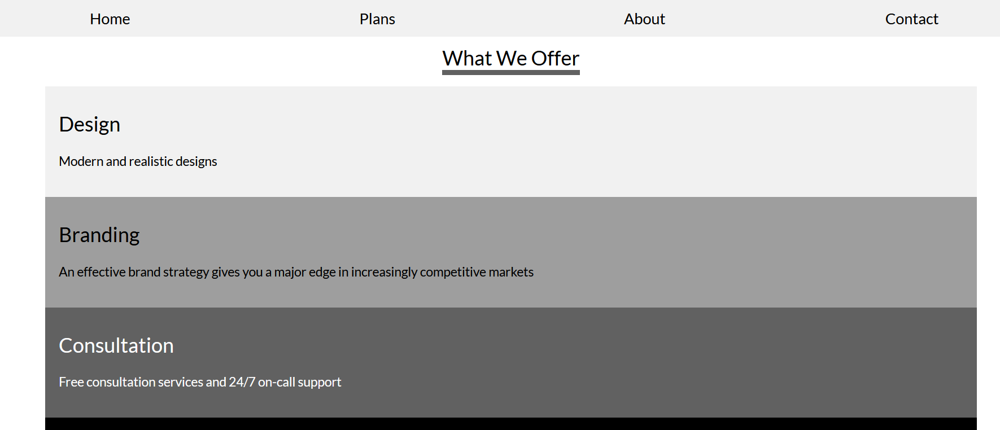
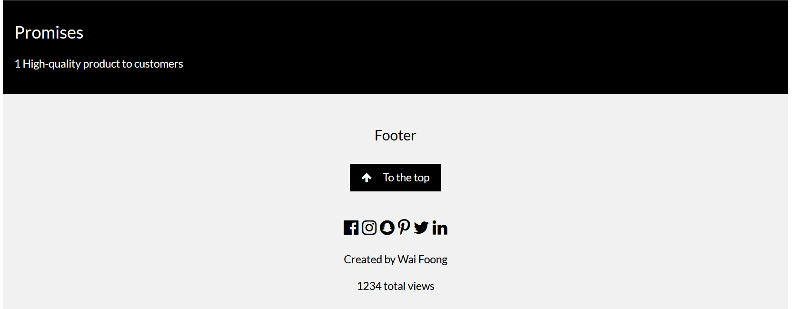
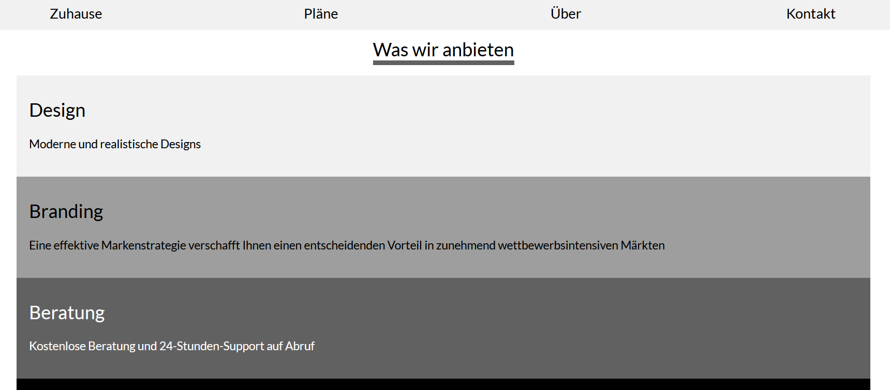

# Tornado i18n
Learn how to implement i18n in Tornado web framework. It comes with its own internationalization support.

# Setup
For your information, this tutorial is based on Python3. Highly recommended to create a virtual environment before the installation

## Manual Installation
Run the following command in your terminal.

    pip install tornado

## Installation via Requirement File
You can install all the necessary packages via the following command (tested on Windows 10, Python 3.7.7)

    pip install -r requirements.txt

# Language Files
Language files is based on CSV format

## Example (en_US.csv)
```
home,Home
plans,Plans
about,About
contact,Contact
what-we-offer,What We Offer
design,Design
branding,Branding
consultation,Consultation
promises,Promises
footer,Footer
top,To the top
design-description,Modern and realistic designs
branding-description,An effective brand strategy gives you a major edge in increasingly competitive markets
consultation-description,Free consultation services and 24/7 on-call support
promises-description,High-quality product to customers,singular
promises-description,High-quality products to customers,plural
created-by,Created by %(author)s
total-view,%(view)d total views
```

## Format
It accepts 3 parameters
* key
* translation text
* plural indicator (optional)

For example,

    home,Home

where `home` is the key while `Home` is the translation text

Pluralization can be defined as follows:

    promises-description,High-quality product to customers,singular
    promises-description,High-quality products to customers,plural

It accepts Python-style named placeholder

    created-by,Created by %(author)s
    total-view,%(view)d total views

`%(author)s` represents string input while `%(view)d` represents integer input

# index.html
This tutorial uses the lite version of [marketing HTML template made by W3.CSS](https://www.w3schools.com/w3css/tryw3css_templates_marketing.htm)

# myapp.py
Complete code for Tornado server

```python
import tornado.ioloop
import tornado.web


class MainHandler(tornado.web.RequestHandler):
    def get(self):
        self.write("Hello, world")


class LocaleHandler(tornado.web.RequestHandler):
    def get(self, locale):
        self.locale = tornado.locale.get(locale)
        self.render("index.html", product=1, author='Wai Foong', view=1234)


def make_app():
    return tornado.web.Application([
        (r"/", MainHandler),
        (r"/([^/]+)/about-us", LocaleHandler),
    ], template_path='templates/')


if __name__ == "__main__":
    tornado.locale.load_translations('locale/')

    app = make_app()
    app.listen(8888)
    tornado.ioloop.IOLoop.current().start()
```

# Running Tornado Server

    python myapp.py

# Loading the web app in your browser
Webpage for English (default)

    http://localhost:8888/en_US/about-us



Footer



For German internationalization, go to the following url

    http://localhost:8888/de_DE/about-us


